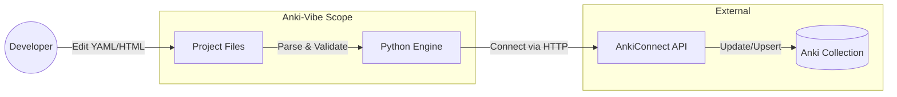

# Kiến Trúc Hệ Thống & Quy Trình Làm Việc (Anki-Vibe)

Tài liệu này mô tả triết lý thiết kế, cấu trúc dữ liệu và quy trình đồng bộ hóa cho dự án `anki-vibe`.

## 1. Triết Lý Cốt Lõi (Core Philosophy)

* **Code-as-Source-of-Truth:** Mã nguồn (YAML/HTML/Python) là nguồn dữ liệu gốc duy nhất. Dữ liệu trên Anki (App) chỉ là bản hiển thị (projection) của dữ liệu trong Code.
* **Unidirectional Data Flow:** Luồng dữ liệu đi một chiều: `Code -> Anki`. Không hỗ trợ sync ngược từ Anki về Code để tránh xung đột (trừ lần import khởi tạo ban đầu).
* **Schema-Centric Organization:** Dữ liệu được tổ chức theo cấu trúc (Note Types) thay vì vị trí lưu trữ (Decks).

## 2. Quy Trình Làm Việc (Workflow)



1.  **Chỉnh sửa (Develop):** Người dùng chỉnh sửa nội dung bài học trong các file YAML và giao diện thẻ trong các file HTML/CSS.
2.  **Đồng bộ (Sync):** Chạy lệnh CLI để đẩy thay đổi lên Anki.
    * Lệnh: `python src/main.py sync --profile "UserA"`
3.  **Hiển thị (Review):** Mở Anki để học tập.

## 3. Cấu Trúc Tổ Chức Dữ Liệu (Data Structure)

Chúng ta tổ chức dữ liệu dựa trên **Profile** và **Note Type (Model)**.

### Cây thư mục
```text
anki-vibe/
├── data/
│   ├── UserA/                  # Tên Profile Anki
│   │   ├── Basic_English/      # Tên Note Type (Model)
│   │   │   ├── config.yaml     # Cấu hình Model (Fields, Templates mapping)
│   │   │   ├── unit1.yaml      # Dữ liệu bài 1
│   │   │   ├── unit2.yaml      # Dữ liệu bài 2
│   │   │   └── images/         # (Optional) Symlink để preview ảnh
│   │   └── Cloze_Geography/    # Note Type khác
│   └── UserB/                  # Profile khác
```

### Tại sao chọn Note Type làm thư mục gốc?
* Một **Note Type** có cấu trúc trường (Fields) cố định. Việc này giúp dễ dàng validate dữ liệu đầu vào.
* **Deck** chỉ là một thuộc tính của Note. Một Note Type có thể tạo ra các note nằm rải rác ở nhiều Deck khác nhau.

## 4. Định Dạng Dữ Liệu (File Format)

Chúng ta sử dụng **YAML** thay vì JSON.

**Lý do:**
1.  **Multi-line Strings:** Hỗ trợ viết HTML nhiều dòng sạch sẽ (rất quan trọng cho các trường Front/Back của Anki).
2.  **Comments:** Cho phép ghi chú trực tiếp vào file dữ liệu.
3.  **Readability:** Dễ đọc và chỉnh sửa bằng mắt thường.

**Ví dụ cấu trúc file `.yaml`:**

```yaml
# data/UserA/Basic_English/unit1.yaml
- deck: "English::Vocabulary"   # Deck đích
  tags: ["unit1", "food"]       # Tags
  fields:
    Word: "Apple"
    Meaning: |
      <div>
        <b>Quả táo</b>
      </div>
      
    Sound: "[sound:apple.mp3]"
```

## 5. Quản Lý Media (Hình ảnh/Âm thanh)

* **Nguyên tắc:** Project **không lưu trữ vật lý** các file media nặng để giữ Git repo nhẹ nhàng.
* **Tham chiếu:** Trong file YAML, media chỉ được lưu dưới dạng chuỗi văn bản (tên file), ví dụ: `apple.png`.
* **Lưu trữ thực tế:** File thực tế nằm trong folder `collection.media` của Anki. AnkiConnect sẽ tự động tìm kiếm file này dựa trên tên.
* **Local Preview:** Có thể tạo Symlink từ folder media của Anki vào folder `data` nếu muốn xem trước ảnh trên Code Editor, nhưng không commit symlink này.

## 6. Chiến Lược Xử Lý Dữ Liệu Lớn

* **Splitting:** Không dồn 1000 notes vào một file. Chia nhỏ thành nhiều file YAML (`part1.yaml`, `part2.yaml`, `chapter1.yaml`) trong cùng thư mục Note Type.
* **Merging:** Tool sẽ tự động quét và gộp tất cả file YAML trong thư mục khi chạy sync.